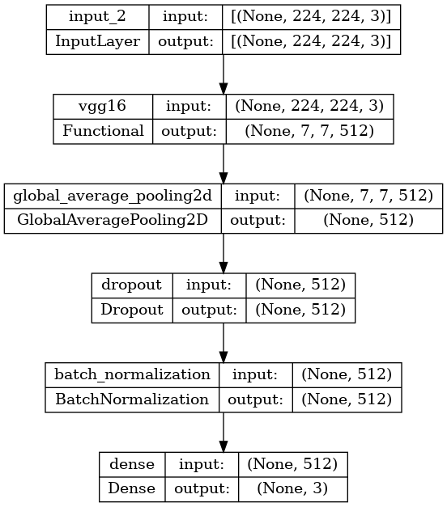

# "Cloudiness Estimation in Images Using VGG16: A Data-Driven Approach"

# Abstract

<p align="justify"> In this paper, we present a novel approach to estimate cloudiness in images using a specially curated dataset derived from the publicly available Transient Attribute Dataset. Our model aims to predict cloudiness confidence levels—categorized into less cloudy, partially cloudy, and more cloudy—based on input images. By employing a pretrained VGG16 model, we achieved approximately 60% accuracy on our validation dataset. The regression output provides a continuous prediction of cloudiness confidence, while classification tasks yield discrete labels. This data-driven approach allows for simultaneous representation learning and label discretization, resulting in more accurate and reliable cloudiness prediction compared to traditional methods.</p>

## Introduction
Cloudiness estimation in images has become an increasingly important task in computer vision, with applications ranging from weather forecasting to environmental monitoring. Traditional methods for cloudiness assessment often rely on manual observations or predefined thresholds, which can be subjective and inconsistent. In this study, we propose a novel data-driven approach to estimate cloudiness levels in images by leveraging the capabilities of deep convolutional neural networks (CNNs). We utilize a curated dataset derived from the publicly available Transient Attribute Dataset to train a model that predicts cloudiness confidence levels—categorized into less cloudy, partially cloudy, and more cloudy—based on input images. Our approach aims to improve the accuracy and reliability of cloudiness estimation by learning optimal thresholds and representations simultaneously.

## Methodology

### Dataset Preparation
We created a cloudiness dataset by extracting relevant images from the Transient Attribute Dataset, focusing on three categories: less cloudy, partially cloudy, and more cloudy. The dataset was then split into training, validation, and test sets.

### Model Architecture
We employed the VGG16 model, pretrained on the ImageNet dataset, as the base model for our cloudiness estimation task. The model was modified to include a global average pooling layer, a dropout layer with a rate of 0.2, and a batch normalization layer. The final output layer is a dense layer with three neurons, corresponding to the three cloudiness categories, and a softmax activation function to provide the confidence scores.

```python
def define_model(pretrained, num_classes):
    base_model = VGG16(weights='imagenet' if pretrained else None, include_top=False, input_shape=(224, 224, 3))
    base_model.trainable = False  # Freeze all layers initially
    
    inputs = tf.keras.Input(shape=(224, 224, 3))
    x = base_model(inputs, training=False)
    x = GlobalAveragePooling2D()(x)
    x = tf.keras.layers.Dropout(0.2)(x)
    x = tf.keras.layers.BatchNormalization()(x)
    outputs = tf.keras.layers.Dense(num_classes, kernel_regularizer=regularizers.l2(0.01), activation='softmax')(x)
    
    model = tf.keras.Model(inputs, outputs)
    return model
```

<p align="center"></a></p>

### Training Procedure
The model was trained using the Adam optimizer with a learning rate of 10^-4. The loss function used was categorical cross-entropy, and the performance metrics included categorical accuracy and mean squared error (MSE). The training process incorporated several callbacks, such as ModelCheckpoint to save the best model, EarlyStopping to halt training if no improvement was observed, and ReduceLROnPlateau to reduce the learning rate when the validation loss plateaued.

```python
def train(model, train_loader, val_loader, epochs, lr=1e-5):
    model.compile(optimizer=tf.keras.optimizers.Adam(learning_rate=lr),
                  loss=tf.keras.losses.CategoricalCrossentropy(),
                  metrics=[tf.keras.metrics.CategoricalAccuracy(name='Accuracy'),
                           tf.keras.metrics.MeanSquaredError(name='MSE')])
    
    checkpoint_path = os.path.join(MODEL_PATH, 'vgg16_0_trained.h5')
    checkpoint = ModelCheckpoint(checkpoint_path, monitor='val_loss', save_best_only=True, mode='min', verbose=1)
    early_stopping = EarlyStopping(monitor='val_loss', patience=15, restore_best_weights=True)
    reduce_lr = ReduceLROnPlateau(monitor='val_loss', factor=0.2, patience=5, min_lr=0.001)
    visualization_callback = ImageVisualizationCallback(train_loader)
    
    history = model.fit(
        train_loader,
        validation_data=val_loader,
        epochs=epochs,
        callbacks=[checkpoint, early_stopping, reduce_lr]
    )
```
<p align="center"></a></p>

### Evaluation
The trained model was evaluated on the validation dataset to assess its accuracy and MSE. Additionally, we visualized the training process by plotting the loss and accuracy curves for both training and validation sets.

### Regression Model Output
To enhance the precision of our regression model's output, we implement a mechanism to predict both the mean and variance of the output. By assuming a Gaussian distribution for the predictions, we can use the mean and variance to fine-tune our loss function. This approach aims to minimize the variance close to the actual value and accurately peak the mean value, resulting in a more precise prediction. The loss function is designed to optimize the Gaussian parameters, ensuring that our model provides accurate and reliable cloudiness estimations.